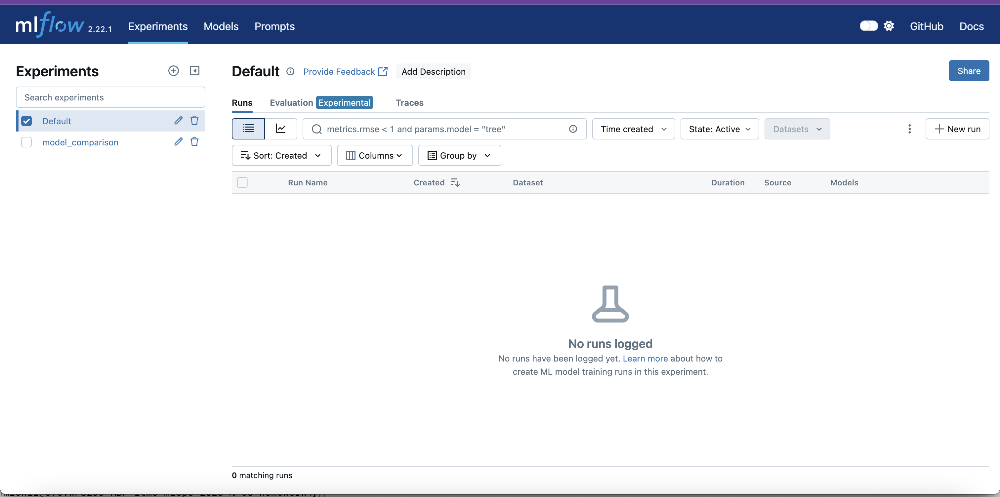
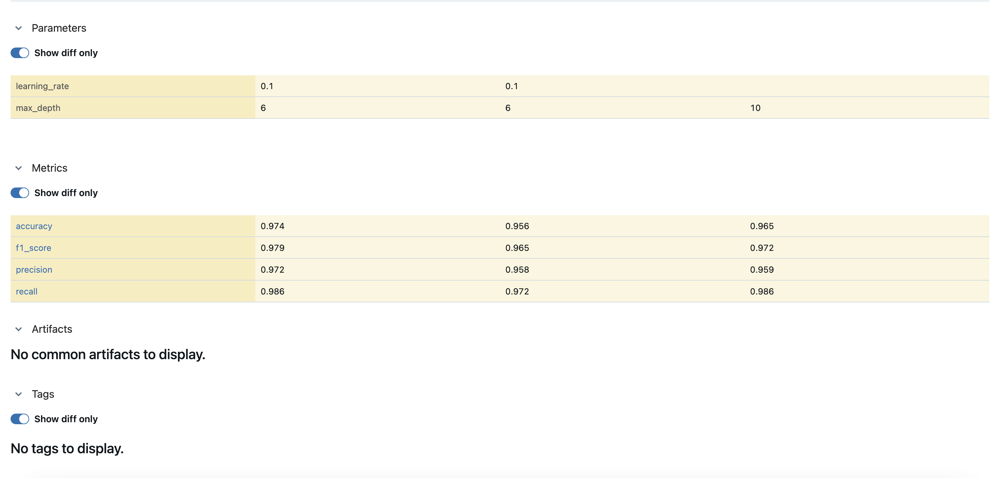

# Отчет по сравнению моделей машинного обучения

## Введение

В данном эксперименте мы сравнили три различные модели машинного обучения для решения задачи классификации на наборе данных о раке молочной железы (Breast Cancer Wisconsin Dataset). Целью было определить, какая из моделей показывает наилучшие результаты по различным метрикам качества.

## Использованные инструменты

1. **MLflow** для трекинга экспериментов


   - Логирование параметров моделей
   - Отслеживание метрик
   - Сохранение артефактов

2. **DVC** для версионирования данных
   - Управление версиями датасета
   - Воспроизводимость экспериментов

## Сравниваемые модели

### 1. Random Forest
- Параметры:
  - n_estimators: 100
  - max_depth: 10
  - random_state: 42

### 2. XGBoost
- Параметры:
  - n_estimators: 100
  - max_depth: 6
  - learning_rate: 0.1
  - random_state: 42

### 3. LightGBM
- Параметры:
  - n_estimators: 100
  - max_depth: 6
  - learning_rate: 0.1
  - random_state: 42

## Результаты экспериментов

### Сравнение метрик

| Модель        | Accuracy | F1-Score | Precision | Recall |
|--------------|----------|-----------|-----------|---------|
| LightGBM     | 0.9737   | 0.9790   | 0.9722    | 0.9859  |
| RandomForest | 0.9649   | 0.9722   | 0.9589    | 0.9859  |
| XGBoost      | 0.9561   | 0.9650   | 0.9583    | 0.9718  |

### Визуализация результатов



## Анализ результатов

### Лучшие показатели по метрикам:
1. **Accuracy (Точность классификации)**
   - Лучшая модель: LightGBM (97.37%)

2. **F1-Score (Гармоническое среднее точности и полноты)**
   - Лучшая модель: LightGBM (97.90%)

3. **Precision (Точность)**
   - Лучшая модель: LightGBM (97.22%)

4. **Recall (Полнота)**
   - Лучшие модели: LightGBM и RandomForest (98.59%)

## Выводы

1. **Общая производительность**
   - Все модели показали высокую эффективность с точностью классификации выше 95%
   - LightGBM продемонстрировал лучшие результаты по большинству метрик

2. **Сравнение моделей**
   - LightGBM лидирует по трем из четырех метрик
   - RandomForest показывает сопоставимые результаты, особенно по метрике Recall
   - XGBoost немного уступает другим моделям, но все еще показывает высокие результаты

3. **Рекомендации**
   - Для данной задачи классификации рекомендуется использовать модель LightGBM
   - При критичности метрики Recall можно также рассмотреть RandomForest
   - Все модели показывают достаточно высокое качество для практического применения

## Воспроизведение экспериментов

Для воспроизведения экспериментов необходимо:

1. Установить зависимости:
```bash
pip install -r requirements.txt
```

2. Запустить MLflow UI:
```bash
mlflow ui
```

3. Запустить эксперименты:
```bash
python experiments/train_models.py
```

4. Сгенерировать отчет:
```bash
python experiments/analyze_results.py 