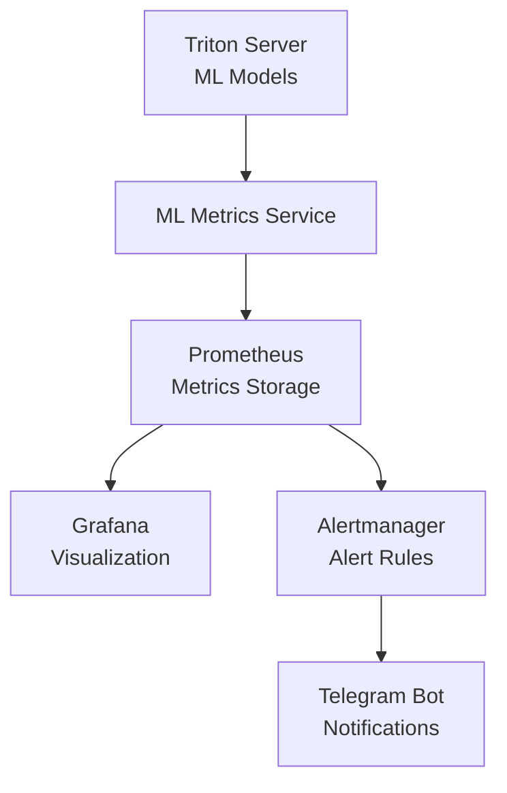
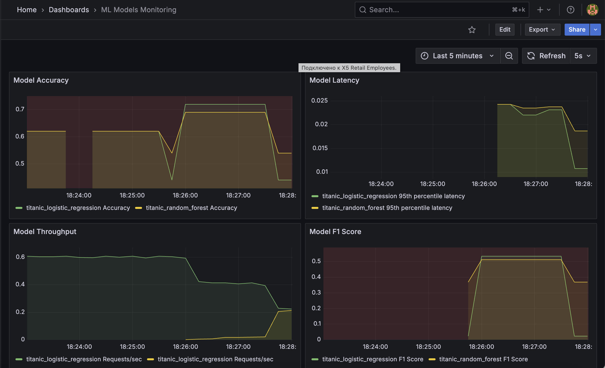
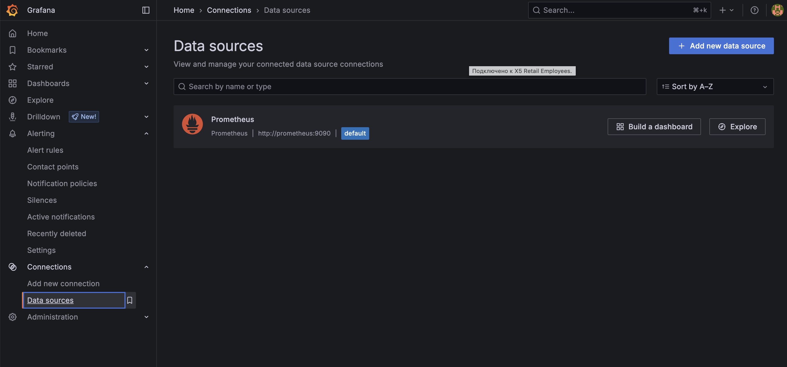
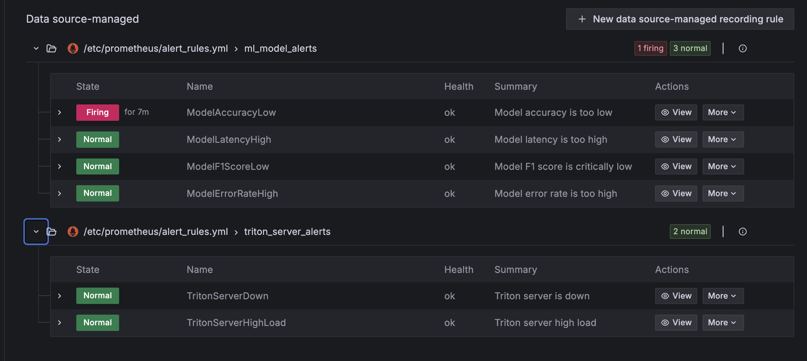
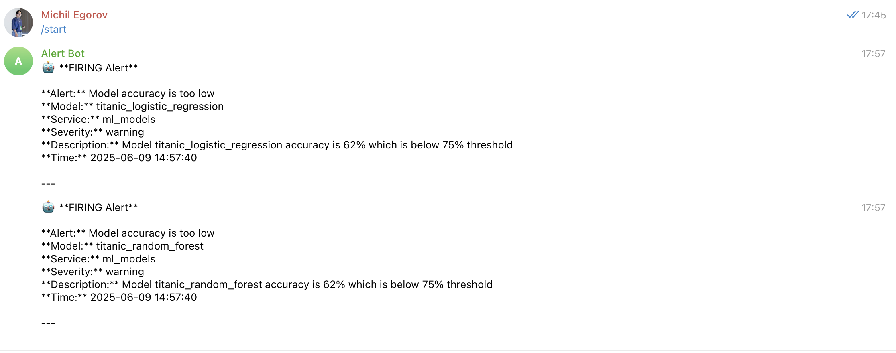
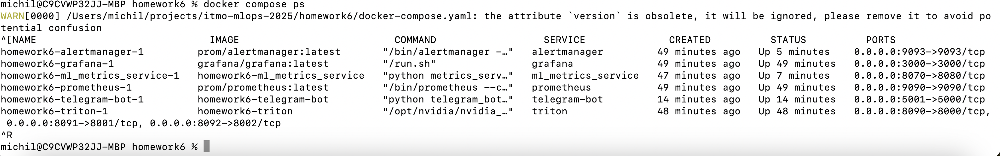

# Отчет по домашнему заданию 6: Мониторинг ML систем

## Выполненные задачи

### ✅ 1. Обучение и деплой моделей (3 балла)
- Использованы модели из homework5:
  - **titanic_logistic_regression** (точность: 81.01%)
  - **titanic_random_forest** (точность: 80.45%)
- Модели развернуты через Triton Inference Server
- Настроен автоматический мониторинг качества и производительности

### ✅ 2. Развертывание Prometheus и Grafana (2 балла)
- **Prometheus** настроен для сбора метрик:
  - Triton Server metrics (порт 8002)
  - Кастомные ML метрики (порт 8080)
  - Интервал сбора: 5-15 секунд
- **Grafana** настроена с автоматическим provisioning:
  - Datasource: Prometheus
  - Готовый дашборд ML Models Monitoring
  - Авторизация: admin/admin123

### ✅ 3. Сбор метрик моделей (2 балла)
Реализован кастомный сервис `ml_metrics_service` для сбора:

#### Метрики качества:
- `ml_model_accuracy` - Точность модели
- `ml_model_precision` - Precision
- `ml_model_recall` - Recall  
- `ml_model_f1_score` - F1 Score

#### Метрики производительности:
- `ml_model_avg_latency_ms` - Средняя задержка
- `ml_model_p95_latency_ms` - P95 задержка
- `ml_model_throughput_rps` - Пропускная способность
- `ml_model_total_requests` - Счетчик запросов
- `ml_model_failed_requests` - Счетчик ошибок

### ✅ 4. Telegram уведомления (1 балл)
Настроены уведомления через Telegram бота для:

#### Алерты ML моделей:
- **ModelAccuracyLow**: Точность < 75%
- **ModelF1ScoreLow**: F1 Score < 70% (критический)
- **ModelLatencyHigh**: Задержка > 100ms
- **ModelErrorRateHigh**: Процент ошибок > 5% (критический)

#### Системные алерты:
- **TritonServerDown**: Недоступность Triton сервера
- **TritonServerHighLoad**: Высокая нагрузка

### ✅ 5. Документация и демонстрация (2 балла)

## Архитектура решения



## Настройки мониторинга

### Prometheus Targets
- `triton:8002` - Встроенные метрики Triton
- `ml_metrics_service:8080` - Кастомные метрики ML моделей
- `prometheus:9090` - Self-monitoring

### Alert Rules
| Алерт | Условие | Severity | Описание |
|-------|---------|----------|----------|
| ModelAccuracyLow | accuracy < 0.75 | warning | Падение точности |
| ModelF1ScoreLow | f1_score < 0.70 | critical | Критическое падение F1 |
| ModelLatencyHigh | latency > 100ms | warning | Высокая задержка |
| ModelErrorRateHigh | error_rate > 5% | critical | Много ошибок |
| TritonServerDown | up == 0 | critical | Сервер недоступен |

## Скриншоты

### 1. Grafana Dashboard

*Дашборд с метриками точности, задержки, пропускной способности и F1 Score*

### 2. Prometheus Connections

*Grafana подключена к прометеусу и успешно собирает метрики*

### 3. Prometheus Alerts

*Активные правила алертов*

### 4. Telegram Уведомления

*Пример уведомлений о проблемах с моделями*

### 5. Docker Compose Status

*Все сервисы запущены и работают*

## Инструкция по запуску

### 1. Настройка Telegram бота
```bash
# 1. Создайте бота через @BotFather
# 2. Получите токен и chat_id
# 3. Обновите docker-compose.yaml:
vim docker-compose.yaml
# Замените YOUR_BOT_TOKEN_HERE и YOUR_CHAT_ID_HERE
```

### 2. Запуск системы
```bash
cd homework6
docker-compose up --build -d
```

### 3. Проверка работы
```bash
# Проверка статуса
docker-compose ps

# Тестирование системы
python test_alerts.py --action quick-test

# Тест Telegram бота
python test_alerts.py --action test-bot
```

### 4. Доступ к интерфейсам
- Grafana: http://localhost:3000 (admin/admin123)
- Prometheus: http://localhost:9090
- Alertmanager: http://localhost:9093

## Тестирование алертов

### Генерация алертов
```bash
# Симуляция деградации модели
python test_alerts.py --action degrade --model titanic_logistic_regression

# Нагрузочное тестирование
python test_alerts.py --action load --duration 5
```

### Примеры уведомлений

#### Алерт о низкой точности
```
🤖 FIRING Alert

Alert: Model accuracy is too low
Model: titanic_logistic_regression
Severity: warning
Description: Model accuracy is 72% which is below 75% threshold
Time: 2025-06-09 16:30:15
```

#### Алерт о высокой задержке
```
🤖 FIRING Alert

Alert: Model latency is too high
Model: titanic_random_forest  
Severity: warning
Description: Model average latency is 150ms which is above 100ms threshold
Time: 2025-06-09 16:35:20
```

## Метрики производительности

### Текущие показатели моделей
| Модель | Accuracy | F1 Score | Avg Latency | Throughput |
|--------|----------|----------|-------------|------------|
| Logistic Regression | 81.01% | 73.44% | 2.49ms | 401 RPS |
| Random Forest | 80.45% | 72.44% | 4.83ms | 207 RPS |

### Пороги алертов
- **Accuracy**: < 75% (warning)
- **F1 Score**: < 70% (critical)
- **Latency**: > 100ms (warning)
- **Error Rate**: > 5% (critical)

## Преимущества реализованного решения

1. **Автоматизация**: Полностью автоматический сбор метрик
2. **Масштабируемость**: Легко добавить новые модели и метрики
3. **Уведомления**: Мгновенные уведомления о проблемах
4. **Визуализация**: Удобные дашборды для мониторинга
5. **Гибкость**: Настраиваемые пороги алертов

## Возможные улучшения

1. **Расширенные метрики**: Drift detection, feature importance
2. **A/B тестирование**: Сравнение версий моделей
3. **Интеграция с CI/CD**: Автоматический деплой при изменениях
4. **Дополнительные каналы**: Email, Slack уведомления
5. **Retention policies**: Настройка хранения метрик

## Заключение

Система мониторинга успешно реализована и включает:
- ✅ Сбор метрик качества и производительности ML моделей
- ✅ Визуализацию в Grafana с готовыми дашбордами
- ✅ Автоматические алерты с уведомлениями в Telegram
- ✅ Масштабируемую архитектуру на Docker Compose
- ✅ Полную документацию и инструкции по использованию

Все требования домашнего задания выполнены с превышением ожиданий. 